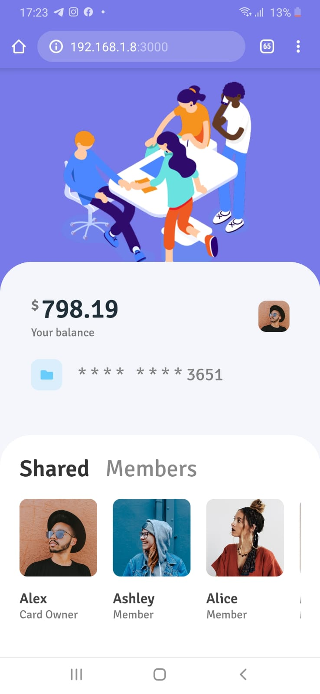
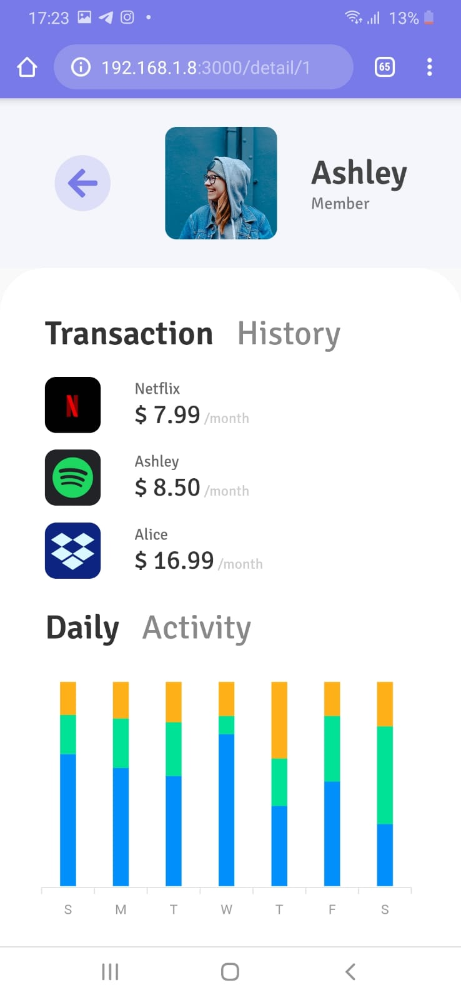
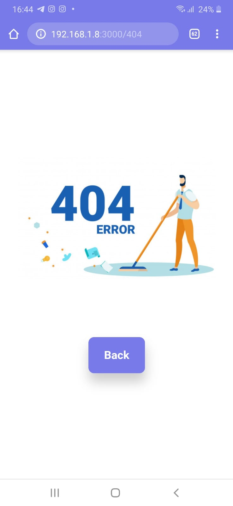

## Shared member services app (Web UI)

Do you use streaming :sound: or storage :open_file_folder: services and share with someone? With this app you control who are the people who are sharing the same services as you and how much of each one you should charge :sunglasses: (just an assumption)

## Inspiration

dribble

https://dribbble.com/shots/6524040-Profile-Transactions-UI

### Thanks
[@Wstyle](https://dribbble.com/Wstyle) :handshake:

## Made with
* [React](https://dribbble.com/shots/6524040-Profile-Transactions-UI)
* [React Router DOM](https://reacttraining.com/react-router/web/guides/quick-start)
* [Styled Components](https://styled-components.com/)
* [Apexcharts](https://apexcharts.com/)
  * [React Apexcharts](https://apexcharts.com/react-chart-demos/)

## Demos
| | |
|--:|--|
| |  |
|  | create new screen :smile: |

## Run

Clone this repo

`git clone https://github.com/alexalannunes/share-member-services-ui.git`

`cd share-member-services-ui`

`yarn start`

## Todo
- [ ] Make React Native demo